<!--
**eden-brekke/eden-brekke** is a ✨ _special_ ✨ repository because its `README.md` (this file) appears on your GitHub profile.

Here are some ideas to get you started:

- 🔭 I’m currently working on ...
- 🌱 I’m currently learning ...
- 👯 I’m looking to collaborate on ...
- 🤔 I’m looking for help with ...
- 💬 Ask me about ...
- 📫 How to reach me: ...
- 😄 Pronouns: ...
- ⚡ Fun fact: ...
-->
# 👋 &nbsp; Hello There! I’m Eden, pleased to have you here!

I am a Full Stack software developer, virology research scientist, and life long learner who thrives in fast paced environments. I am passionate about science and using the power of research and technology to push for the betterment of society and the world. I want to use my knowledge and drive to push for an impactful change. My background is in microbiology and mentorship.

##  Languages

|  |  |  |  |
| ----------- | ----------- | ----------- | ----------- |
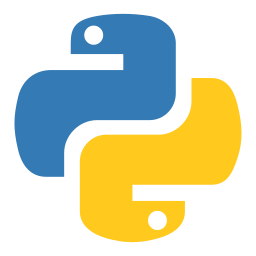 | 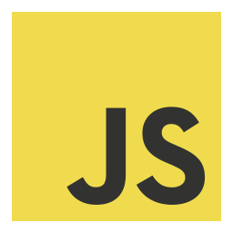 |  | 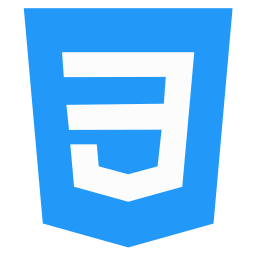 |
|  |  |  |  |

## Projects

- Tech Spotlight
  - [Repo]()
  - [Jupyter Notebook]()
- Smells Like Devs Cooking
  - [Front End Repo]()
  - [Back End Repo]()
- CODLE
  - [Repo]()
- YourSpace
  - [Front End Repo]()
  - [Back end Repo]()
- [Python Data Structures and Algorithms]()

## Tools
| | | |
| ----------- | ----------- | ----------- |
| 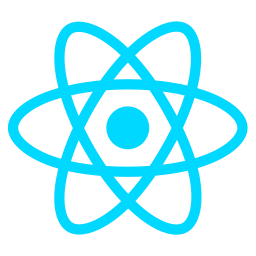 React |  Visual Studio Code | 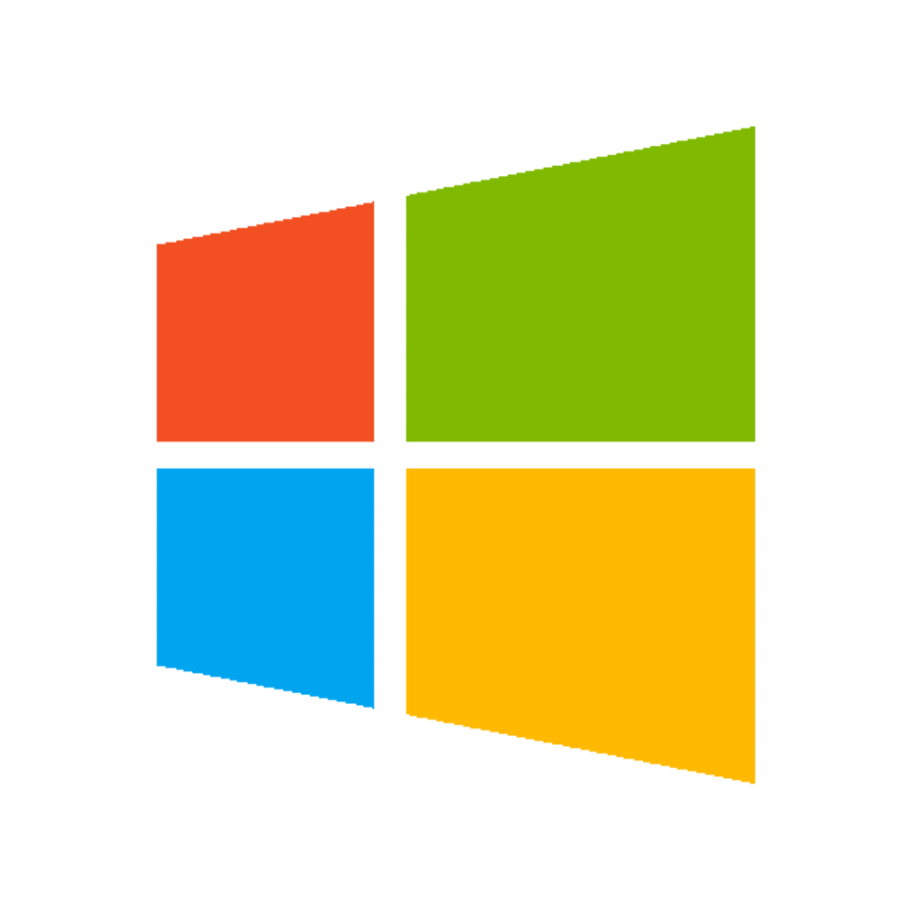 WindowsOS |
| 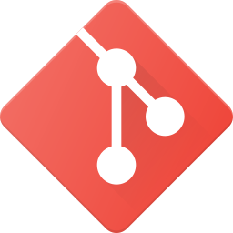 Git | 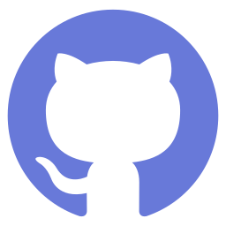 Github | 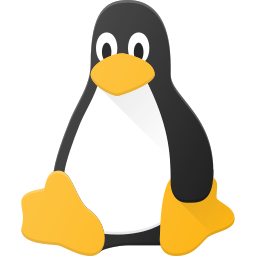 Linux |
| 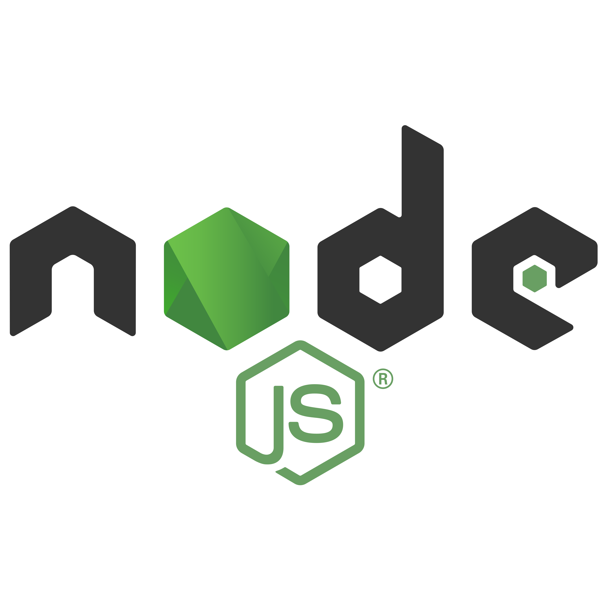 Nodejs | 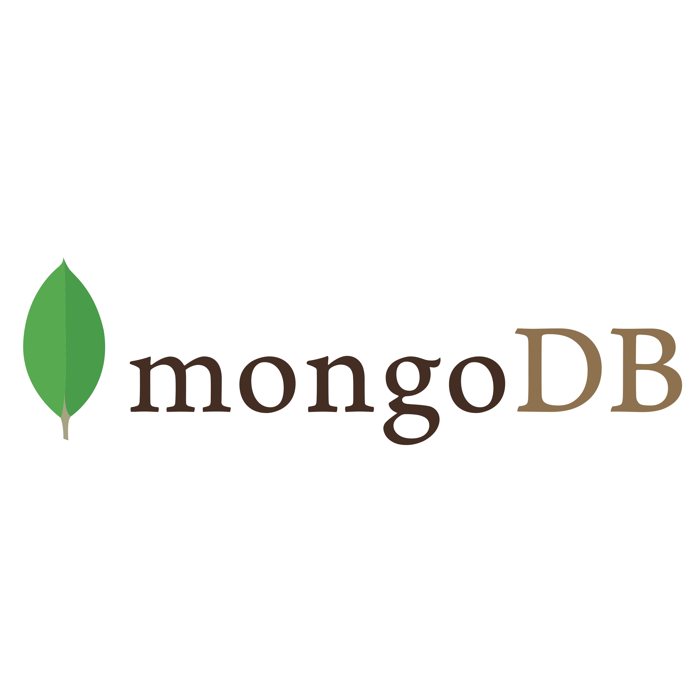 MongoDB | 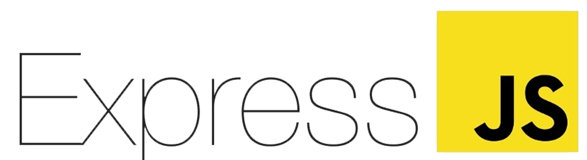 Expressjs |
| NextJS | Django |  Docker |
| Vercel | 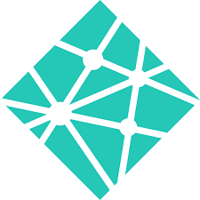 Netlify | 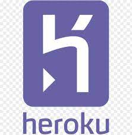 Heroku  | 
| | | |

## Hobbies / Interests

- Video games
- Science
- Cooking
- Art
- Yoga
- Animals

## Connect with me

  &nbsp;  &nbsp;&nbsp; [Linkedin]()

  &nbsp;  &nbsp;&nbsp; eden.lorrai@gmail.com