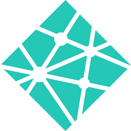

<!--
**eden-brekke/eden-brekke** is a ✨ _special_ ✨ repository because its `README.md` (this file) appears on your GitHub profile.

Here are some ideas to get you started:

- 🔭 I’m currently working on ...
- 🌱 I’m currently learning ...
- 👯 I’m looking to collaborate on ...
- 🤔 I’m looking for help with ...
- 💬 Ask me about ...
- 📫 How to reach me: ...
- 😄 Pronouns: ...
- ⚡ Fun fact: ...
-->

## 🎉 &nbsp; Hey There! I’m Eden, pleased to have you here!

I am a Full Stack software developer, virology research scientist, and life long learner who thrives in fast paced environments. I am passionate about science and using the power of research and technology to push for the betterment of society and the world. I want to use my knowledge and drive to push for an impactful change. My background is in microbiology and mentorship.

### 🔗 Connect with me
I love making connections, and would like to hear from you! Reach out to me on the following Social Accounts

### 💻 Languages
___
 
<table>
  <tr>
    <td style="text-align: center;">
       Python
    </td>
    <td style="text-align: center;">
       JavaScript
    </td>
    <td style="text-align: center;">
       TypeScript
    </td>
    <td style="text-align: center;">
       HTML
    </td>
    <td style="text-align: center;">
       CSS
    </td>
    <td style="text-align: center;">
       SQL
    </td>
  </tr>
</table>

___

 

###  GitHub Stats

 

 

### 🛠️ Tools

| | | |
| ----------- | ----------- | ----------- |
|  React |  Visual Studio Code |  Pycharm |
| AWS |  PostgresQL |  MaterialUI |
| Django |  Git |  Github |
|  Nodejs | NextJS |  Expressjs |
|  MacOS |  MongoDB |  Docker |
| Vercel |  Netlify |  Heroku  |
| | | |

 

### Projects

___
- Tech Spotlight
  - A Web Scraper targeting Indeed.com built with Python. We wanted a tool that would grab the frequency at which technology terminology pops up. We’ve plotted the term occurrence data on a Jupyter notebook.
  - [Repo](https://github.com/regex-rejects/tech-spotlight)
  - [Jupyter Notebook](https://www.kaggle.com/code/edenbrekke/tech-spotlight-indeed-data-18may2022/notebook)
- Smells Like Devs Cooking
  - A Cooking Blog where you can create a user, login and then post your own recipes. It was created using Next.JS and TailwindCSS in the front end, and Django Rest Framework, ElephantSQL and deployed with Docker in the backend.
  - [Front End Repo](https://github.com/The-Spice-Devs/Smells-Like-Devs-Cooking-Frontend)
  - [Back End Repo](https://github.com/The-Spice-Devs/Smells-Like-Devs-Cooking-API)
- CODLE
  - A replica of WORDL built with JavaScript, HTML, and CSS that allows you to guess 5-letter code terminology, includes a description of the term when guessed, allowing for a fun interactive study guide.
  - [Repo](https://github.com/Team-Salt-Lake-City/code-wordle)
- YourSpace
  - A play on old school MySpace that allows users to search for musics through the Itunes API, preview the song, and save it to their profile for later. They can view the saved songs on their profile and add personal comments to each song they've saved.
  - [Front End Repo](https://github.com/the-golden-order/your-space)
  - [Back end Repo](https://github.com/the-golden-order/your-space-server)
- [Python Data Structures and Algorithms](https://github.com/eden-brekke/python-data-structures-and-algorithms/tree/main/python)
___

 

## Hobbies / Interests

___

- Video games 🎮 🖥️
- Crochet 🧶 🪝
- Animals 🐆 🪿
- Cooking 🍳 🍲
- Science 🧪 🔬

 
